# 📊 IPSI AI Matching - Visual Diagrams

**Purpose:** Mermaid diagrams to explain project architecture, data flow, and privacy  
**Date:** November 24, 2025  
**Usage:** Copy diagrams to presentations, documentation, or GitHub README

---

## 1️⃣ **Overall Project Architecture**

### **High-Level System Overview**


**Description:** Shows the complete system with IPSI platform on the left and your AI microservice on the right, connected via API.

---

## 2️⃣ **Data Flow - Complete Journey**

### **How Student Data Flows Through the System**


**Description:** Complete flow from student registration to AI service receiving anonymized data.

---

## 3️⃣ **Matching Process Flow**

### **How Matching Works (HR Searches for Candidates)**


**Description:** Shows the complete matching process from HR request to displaying results.

---

## 4️⃣ **Privacy & Data Separation**

### **What Data Exists Where**

```mermaid
graph TB
    subgraph "IPSI Database - Personal Data"
        A1[Student Names]
        A2[Email Addresses]
        A3[Phone Numbers]
        A4[Home Addresses]
        A5[Date of Birth]
        A6[National IDs]
        A7["Skills, Education, Experience"]
    end
    
    subgraph "Anonymization Layer (Brain Appeal)"
        B1[Hash Student ID]
        B2[Remove All PII]
        B3[Keep Only Professional Info]
    end
    
    subgraph "AI Microservice - Anonymous Data"
        C1[student_hash_12345]
        C2["Skills: [Python, Java]"]
        C3["Education: Bachelor's CS"]
        C4["Experience: 2 years"]
        C5["Projects: [...]"]
        C6[NO NAMES ❌]
        C7[NO EMAILS ❌]
        C8[NO PHONES ❌]
    end
    
    A7 --> B1
    A7 --> B2
    A7 --> B3
    
    B1 --> C1
    B2 --> C2
    B2 --> C3
    B3 --> C4
    B3 --> C5
    
    A1 -.x B2
    A2 -.x B2
    A3 -.x B2
    A4 -.x B2
    A5 -.x B2
    A6 -.x B2
    
    style A1 fill:#ffcccc
    style A2 fill:#ffcccc
    style A3 fill:#ffcccc
    style A4 fill:#ffcccc
    style A5 fill:#ffcccc
    style A6 fill:#ffcccc
    style B2 fill:#fff4cc
    style C6 fill:#ccffcc
    style C7 fill:#ccffcc
    style C8 fill:#ccffcc
```

**Description:** Shows clear separation between personal data (stays in IPSI) and anonymous data (goes to AI service).

---

## 5️⃣ **Development vs Production Phases**

### **Project Timeline & Data Usage**


**Description:** Timeline showing parallel development and consent collection tracks.

---

## 6️⃣ **GDPR Compliance Architecture**

### **How GDPR Rights Are Implemented**


**Description:** Maps GDPR rights to technical implementations in your microservice.

---

## 7️⃣ **Database Architecture**

### **Dual Database Design**


**Description:** Shows why you need both PostgreSQL (metadata) and Qdrant (vectors).

---

## 8️⃣ **Consent Flow**

### **How IPSI Collects Consent (Not Your Responsibility)**


**Description:** State machine showing consent lifecycle (IPSI's responsibility).

---

## 9️⃣ **Matching Algorithm Flow**

### **How Semantic Matching Works**


**Description:** Technical flow of how matching works using vector embeddings.

---

## 🔟 **Security & Privacy Layers**

### **Multiple Layers of Protection**


**Description:** Shows the multiple security and privacy layers protecting student data.

---

## 1️⃣1️⃣ **Deployment Architecture**

### **Docker Deployment on IPSI Infrastructure**


**Description:** Shows how your Docker containers deploy alongside IPSI on DHBW infrastructure.

---

## 1️⃣2️⃣ **API Integration Points**

### **How Brain Appeal Integrates Your Service**


**Description:** Shows all API endpoints Brain Appeal needs to integrate.

---

## 1️⃣3️⃣ **Error Handling & Fallback**

### **What Happens When AI Service is Down**


**Description:** Shows graceful degradation if AI service is unavailable.

---

## 1️⃣4️⃣ **Development Workflow**

### **Your Development Process**


**Description:** Git workflow showing feature branches and integration points.

---

## 🎯 **Business Matching Process - Executive Overview**

### **How AI Matching Works (Non-Technical)**

```mermaid
graph TB
    subgraph "📥 INPUT PHASE"
        A[👤 Student Signs Up] --> B[📝 Creates Profile]
        C[🏢 Company Posts Job] --> D[📋 Writes Job Description]
        
        B --> E{{"Skills, Education,<br/>Experience, Preferences"}}
        D --> F{{"Required Skills,<br/>Job Type, Location"}}
    end
    
    subgraph "🧠 AI PROCESSING"
        E --> G["🔮 AI Understands<br/>Student Profile"]
        F --> H["🔮 AI Understands<br/>Job Requirements"]
        
        G --> I[("📊 Semantic<br/>Understanding")]
        H --> I
        
        I --> J["🎯 Find Similar<br/>Profiles"]
    end
    
    subgraph "⚖️ RANKING PHASE"
        J --> K["📈 Calculate Match Scores"]
        
        K --> L["Similarity Score<br/>(How well profiles align)"]
        K --> M["Skills Coverage<br/>(Required skills match)"]
        K --> N["Preferences Match<br/>(Location, job type)"]
        
        L --> O["🏆 Final Ranking"]
        M --> O
        N --> O
    end
    
    subgraph "📤 OUTPUT PHASE"
        O --> P["📋 Ranked Candidate List"]
        
        P --> Q["Top 10 Candidates"]
        Q --> R["For Each Candidate:<br/>• Match Score<br/>• Skills Matched/Missing<br/>• Why Recommended"]
        
        R --> S["👔 HR Reviews<br/>& Contacts Students"]
    end
    
    style A fill:#e3f2fd
    style C fill:#fff3e0
    style I fill:#e8f5e9
    style O fill:#fce4ec
    style S fill:#f3e5f5
```



### **What HR Sees - Match Results**

```mermaid
flowchart LR
    subgraph "🔍 HR DASHBOARD"
        A["Job: Python Developer<br/>Tech Startup GmbH"]
    end
    
    subgraph "📊 TOP MATCHES"
        B["🥇 Student A<br/>━━━━━━━━━━<br/>Match: 87%<br/>Skills: 4/5 ✅<br/>Location: Munich ✅"]
        C["🥈 Student B<br/>━━━━━━━━━━<br/>Match: 82%<br/>Skills: 5/5 ✅<br/>Location: Remote ✅"]
        D["🥉 Student C<br/>━━━━━━━━━━<br/>Match: 78%<br/>Skills: 3/5 ⚠️<br/>Location: Berlin ✅"]
    end
    
    subgraph "📝 INSIGHTS FOR EACH"
        E["✅ Matched Skills:<br/>Python, FastAPI, Docker"]
        F["❌ Missing Skills:<br/>Kubernetes"]
        G["💡 Why Recommended:<br/>Strong backend experience"]
    end
    
    A --> B
    A --> C
    A --> D
    B --> E
    B --> F
    B --> G
    
    style A fill:#1976d2,color:#fff
    style B fill:#4caf50,color:#fff
    style C fill:#8bc34a,color:#fff
    style D fill:#cddc39
```



### **HR Ranking Control (Sliders)**

```mermaid
flowchart TB
    subgraph "🎛️ RANKING PREFERENCES"
        A["<b>Semantic Similarity</b><br/>How well profile matches overall"]
        B["<b>Required Skills</b><br/>Must-have technical skills"]
        C["<b>Preferred Skills</b><br/>Nice-to-have skills"]
    end
    
    subgraph "⚖️ WEIGHT PRESETS"
        D["🔵 Default<br/>Sim: 60% | Req: 30% | Pref: 10%"]
        E["🟢 Skills First<br/>Sim: 30% | Req: 60% | Pref: 10%"]
        F["🟡 Balanced<br/>Sim: 40% | Req: 40% | Pref: 20%"]
    end
    
    subgraph "📊 RESULT"
        G["Different rankings<br/>based on what HR<br/>prioritizes!"]
    end
    
    A --> D
    B --> E
    C --> F
    
    D --> G
    E --> G
    F --> G
    
    style D fill:#2196f3,color:#fff
    style E fill:#4caf50,color:#fff
    style F fill:#ff9800,color:#fff
```



### **Complete Business Flow**


---

## 🔧 **Technical Integration Guide - Brain Appeal Developers**

### **Complete API Integration Flow**

```mermaid
sequenceDiagram
    autonumber
    
    participant IPSI as 🌐 IPSI Backend<br/>(Brain Appeal)
    participant API as 🚀 AI Service<br/>(FastAPI)
    participant DB as 🗄️ PostgreSQL<br/>(Metadata)
    participant VDB as 📊 Qdrant<br/>(Vectors)
    participant LLM as 🧠 OpenAI<br/>(Embeddings)
    
    Note over IPSI,LLM: 🔐 AUTHENTICATION
    
    IPSI->>IPSI: Generate JWT token
    Note right of IPSI: jwt.encode({sub: "ipsi"},<br/>secret, HS256)
    
    Note over IPSI,LLM: 📝 JOB PARSING ENDPOINT
    
    rect rgb(255, 248, 220)
        IPSI->>+API: POST /api/v1/jobs/parse
        Note right of IPSI: Headers:<br/>Authorization: Bearer {token}<br/>Content-Type: application/json
        
        Note right of IPSI: Body:<br/>{<br/>  external_job_id: "job_123",<br/>  external_company_id: "comp_456",<br/>  company_name: "TechCorp",<br/>  raw_description: "Python Dev..."<br/>}
        
        API->>LLM: Parse description (GPT-4)
        LLM-->>API: Structured data
        API->>LLM: Generate embedding
        LLM-->>API: Vector [1536 dims]
        API->>DB: Store job metadata
        API->>VDB: Store job vector
        API-->>-IPSI: 200 OK + job_id
    end
    
    Note over IPSI,LLM: 👤 STUDENT UPDATE ENDPOINT
    
    rect rgb(220, 248, 255)
        IPSI->>+API: POST /api/v1/students/update
        Note right of IPSI: Body:<br/>{<br/>  external_student_id: "stu_789",<br/>  profile_data: {<br/>    skills: [...],<br/>    education: {...},<br/>    preferences: {...}<br/>  }<br/>}
        
        API->>LLM: Generate embedding
        LLM-->>API: Vector [1536 dims]
        API->>DB: Store/update student
        API->>VDB: Store student vector
        API-->>-IPSI: 200 OK + student_id
    end
    
    Note over IPSI,LLM: 🎯 MATCHING ENDPOINT (Main)
    
    rect rgb(220, 255, 220)
        IPSI->>+API: POST /api/v1/matching/students-for-job
        Note right of IPSI: Body:<br/>{<br/>  external_job_id: "job_123",<br/>  top_k: 10,<br/>  min_similarity_score: 0.70,<br/>  ranking_weights: {<br/>    similarity: 0.6,<br/>    required_skills: 0.3,<br/>    preferred_skills: 0.1<br/>  }<br/>}
        
        API->>DB: Fetch job data
        DB-->>API: Job + required/preferred skills
        API->>LLM: Generate job embedding
        LLM-->>API: Query vector
        API->>VDB: Search similar students (top 30)
        VDB-->>API: Candidates + similarity scores
        API->>DB: Fetch student profiles
        DB-->>API: Student data
        
        rect rgb(200, 255, 200)
            Note over API: Re-ranking Logic
            API->>API: For each candidate:
            API->>API: 1. Compute skill overlap
            API->>API: 2. Calculate required_skill_score
            API->>API: 3. Calculate preferred_skill_score
            API->>API: 4. final = w1*sim + w2*req + w3*pref
            API->>API: 5. Sort by final_score
            API->>API: 6. Take top_k
        end
        
        opt AI Insights Enabled
            API->>LLM: Generate insights (GPT-4o)
            LLM-->>API: Match explanations
        end
        
        API->>DB: Store match history
        API-->>-IPSI: 200 OK + ranked matches
    end
```



### **API Endpoints Overview**

```mermaid
flowchart TB
    subgraph "🔓 No Auth Required"
        A["/api/v1/health<br/>━━━━━━━━━━<br/>GET<br/>Health check"]
    end
    
    subgraph "🔐 Auth Required (JWT Bearer)"
        subgraph "📝 Job Management"
            B["/api/v1/jobs/parse<br/>━━━━━━━━━━<br/>POST<br/>Parse job description"]
        end
        
        subgraph "👤 Student Management"
            C["/api/v1/students/update<br/>━━━━━━━━━━<br/>POST<br/>Create/update profile"]
        end
        
        subgraph "🎯 Matching"
            D["/api/v1/matching/students-for-job<br/>━━━━━━━━━━<br/>POST<br/>Find students for job"]
            E["/api/v1/matching/jobs-for-student<br/>━━━━━━━━━━<br/>POST<br/>Find jobs for student"]
        end
    end
    
    F["🌐 IPSI Backend"] --> A
    F --> B
    F --> C
    F --> D
    F --> E
    
    style A fill:#e8f5e9
    style B fill:#fff3e0
    style C fill:#e3f2fd
    style D fill:#fce4ec
    style E fill:#f3e5f5
```



### **Request/Response Data Flow**

```mermaid
flowchart LR
    subgraph "📤 REQUEST"
        A["POST /matching/students-for-job"]
        B["Headers:<br/>Authorization: Bearer token<br/>Content-Type: application/json"]
        C["Body:<br/>{<br/>  external_job_id,<br/>  top_k,<br/>  min_similarity_score,<br/>  ranking_weights,<br/>  filters<br/>}"]
    end
    
    subgraph "⚙️ PROCESSING"
        D["1. Validate JWT"]
        E["2. Fetch Job"]
        F["3. Generate Embedding"]
        G["4. Vector Search"]
        H["5. Re-rank by Weights"]
        I["6. Generate Insights"]
    end
    
    subgraph "📥 RESPONSE"
        J["200 OK"]
        K["{<br/>  job_id,<br/>  job_title,<br/>  matches: [{<br/>    student_id,<br/>    similarity_score,<br/>    rank,<br/>    match_insights: {<br/>      final_score,<br/>      skills_breakdown,<br/>      summary<br/>    }<br/>  }],<br/>  total_candidates,<br/>  returned_count<br/>}"]
    end
    
    A --> D
    B --> D
    C --> D
    D --> E --> F --> G --> H --> I
    I --> J
    J --> K
```

### **Error Handling Flow**

```mermaid
flowchart TB
    subgraph "📤 Request"
        A["POST /api/v1/matching/students-for-job"]
    end
    
    subgraph "🔍 Validation Layer"
        B{Auth Valid?}
        C{Request Valid?}
        D{Job Exists?}
    end
    
    subgraph "⚙️ Processing"
        E[Vector Search]
        F{Qdrant OK?}
        G{OpenAI OK?}
    end
    
    subgraph "❌ Error Responses"
        H["401 Unauthorized<br/>{error: 'Invalid token'}"]
        I["422 Validation Error<br/>{error: 'Invalid request'}"]
        J["404 Not Found<br/>{error: 'JOB_NOT_FOUND'}"]
        K["503 Service Unavailable<br/>{error: 'QDRANT_ERROR'}"]
        L["503 Service Unavailable<br/>{error: 'OPENAI_ERROR'}"]
    end
    
    subgraph "✅ Success"
        M["200 OK<br/>{matches: [...]}"]
    end
    
    A --> B
    B -->|No| H
    B -->|Yes| C
    C -->|No| I
    C -->|Yes| D
    D -->|No| J
    D -->|Yes| E
    E --> F
    F -->|No| K
    F -->|Yes| G
    G -->|No| L
    G -->|Yes| M
    
    style H fill:#ffcdd2
    style I fill:#ffcdd2
    style J fill:#ffcdd2
    style K fill:#ffcdd2
    style L fill:#ffcdd2
    style M fill:#c8e6c9
```

### **Integration Timeline**

```mermaid
gantt
    title Brain Appeal Integration Timeline
    dateFormat  YYYY-MM-DD
    
    section Setup
    Deploy Docker containers       :a1, 2025-01-01, 1d
    Configure environment vars     :a2, after a1, 1d
    Test health endpoint           :a3, after a2, 1d
    
    section Authentication
    Generate JWT secret           :b1, after a3, 1d
    Implement token generation    :b2, after b1, 2d
    Test authenticated requests   :b3, after b2, 1d
    
    section Job Integration
    Implement /jobs/parse call    :c1, after b3, 2d
    Test job parsing              :c2, after c1, 1d
    Handle job updates            :c3, after c2, 1d
    
    section Student Integration
    Implement /students/update    :d1, after c3, 2d
    Test profile sync             :d2, after d1, 1d
    Batch import existing         :d3, after d2, 2d
    
    section Matching Integration
    Implement HR matching view    :e1, after d3, 3d
    Add ranking controls UI       :e2, after e1, 2d
    Implement student job search  :e3, after e2, 2d
    
    section Testing
    Integration testing           :f1, after e3, 3d
    Load testing                  :f2, after f1, 2d
    UAT with real data            :f3, after f2, 3d
    
    section Go Live
    Production deployment         :g1, after f3, 1d
    Monitoring setup              :g2, after g1, 1d
```

### **PHP Integration Code Flow**

```mermaid
sequenceDiagram
    autonumber
    
    participant PHP as 🐘 IPSI PHP Backend
    participant Cache as 📦 Cache Layer
    participant AI as 🤖 AI Service
    
    Note over PHP,AI: Job Posting Flow
    
    PHP->>PHP: Company submits job
    PHP->>PHP: Store in IPSI DB
    PHP->>AI: POST /jobs/parse
    AI-->>PHP: {job_id, structured_data}
    PHP->>PHP: Store job_id mapping
    
    Note over PHP,AI: Student Profile Flow
    
    PHP->>PHP: Student updates profile
    PHP->>PHP: Anonymize data
    PHP->>AI: POST /students/update
    AI-->>PHP: {student_id, embedding_created}
    PHP->>PHP: Store student_id mapping
    
    Note over PHP,AI: HR Matching Flow
    
    PHP->>PHP: HR clicks "Find Candidates"
    PHP->>Cache: Check cache for job
    
    alt Cache Hit
        Cache-->>PHP: Cached results
    else Cache Miss
        PHP->>AI: POST /matching/students-for-job
        AI-->>PHP: {matches: [...]}
        PHP->>Cache: Store results (TTL: 5min)
    end
    
    PHP->>PHP: Map external_student_id to IPSI users
    PHP->>PHP: Render HR dashboard
```

### **Deployment Architecture**

```mermaid
flowchart TB
    subgraph "🌐 IPSI Infrastructure"
        A[("IPSI Database<br/>MySQL/PostgreSQL")]
        B["IPSI Backend<br/>PHP/Laravel"]
        C["IPSI Frontend<br/>Vue/React"]
    end
    
    subgraph "🤖 AI Service (Docker)"
        subgraph "Container: fastapi"
            D["FastAPI App<br/>Port 8000"]
            E["Uvicorn Workers<br/>x4"]
        end
        
        subgraph "Container: qdrant"
            F["Qdrant Vector DB<br/>Port 6333"]
            G[("Vector Storage<br/>./qdrant_storage")]
        end
        
        subgraph "Container: postgres (optional)"
            H[("PostgreSQL<br/>Port 5432")]
        end
    end
    
    subgraph "☁️ External Services"
        I["OpenAI API<br/>(or Aleph Alpha)"]
    end
    
    B <-->|"REST API<br/>JWT Auth"| D
    D --> F
    D --> H
    D --> I
    
    C --> B
    B --> A
    
    style D fill:#4caf50,color:#fff
    style F fill:#2196f3,color:#fff
    style H fill:#ff9800,color:#fff
```

### **Monitoring & Health Checks**

```mermaid
flowchart TB
    subgraph "🔍 Health Check Endpoint"
        A["GET /api/v1/health"]
    end
    
    subgraph "📊 Checks Performed"
        B["PostgreSQL<br/>Connection Test"]
        C["Qdrant<br/>Collection Status"]
        D["OpenAI<br/>API Availability"]
    end
    
    subgraph "📝 Response"
        E["{<br/>  status: 'healthy',<br/>  qdrant_connected: true,<br/>  postgres_connected: true,<br/>  openai_api_available: true,<br/>  version: '1.0.0'<br/>}"]
    end
    
    subgraph "🚨 Alerts (Recommended)"
        F["If status != healthy<br/>→ Alert ops team"]
        G["If response > 5s<br/>→ Performance alert"]
        H["If 5xx errors > 1%<br/>→ Error alert"]
    end
    
    A --> B
    A --> C
    A --> D
    B --> E
    C --> E
    D --> E
    E --> F
    E --> G
    E --> H
    
    style E fill:#c8e6c9
    style F fill:#ffcdd2
    style G fill:#fff3e0
    style H fill:#ffcdd2
```

---

### **In Documentation:**

1. Copy diagram code to your README.md
2. GitHub and most modern platforms render Mermaid automatically
3. Also works in GitLab, Notion, Obsidian

### **In Presentations:**

1. Use Mermaid Live Editor: https://mermaid.live/
2. Paste diagram code
3. Export as PNG/SVG
4. Add to PowerPoint/Google Slides

### **For IPSI/DHBW:**

**Recommended diagrams to share:**
- ✅ **Overall Project Architecture** - High-level overview
- ✅ **Privacy & Data Separation** - Show data protection
- ✅ **Consent Flow** - Explain legal process
- ✅ **Deployment Architecture** - Show technical setup
- ✅ **Business Matching Process** - Non-technical overview (NEW)

### **For Brain Appeal:**

**Recommended diagrams to share:**
- ✅ **API Integration Points** - Show all endpoints
- ✅ **Data Flow - Complete Journey** - How data moves
- ✅ **Matching Process Flow** - How matching works
- ✅ **Error Handling & Fallback** - Resilience strategy
- ✅ **Technical Integration Guide** - Complete API flow (NEW)

---

## 🎨 **Customization Tips**

### **Change Colors:**

```mermaid
graph TB
    A[Node]
    style A fill:#YOUR_COLOR,stroke:#333,stroke-width:2px
```

### **Add Notes:**

```mermaid
sequenceDiagram
    A->>B: Message
    Note right of B: This is a note
    Note over A,B: Note spanning multiple participants
```

### **Highlight Critical Paths:**

```mermaid
graph TB
    A[Start] --> B[Critical Step]
    B --> C[End]
    style B fill:#ff0000,color:#fff
```

---

## ✅ **Diagram Quality Checklist**

All diagrams include:
- [x] Clear labels and descriptions
- [x] Accurate representation of system
- [x] Privacy/security considerations shown
- [x] Color coding for different components
- [x] Notes for important details
- [x] Proper flow direction (top-to-bottom or left-to-right)

---

## 🚀 **Next Steps**

1. ✅ Copy relevant diagrams to your README.md
2. ✅ Use in presentations to IPSI/DHBW
3. ✅ Share integration diagrams with Brain Appeal
4. ✅ Update as project evolves
5. ✅ Export as images for non-technical stakeholders

---

**Last Updated:** November 24, 2025  
**Mermaid Version:** 10.x compatible  
**Status:** Ready to use

